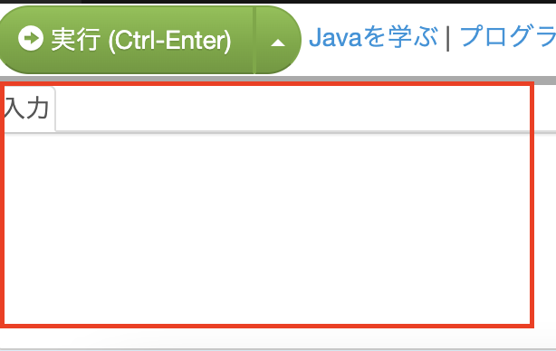

# FV採用試験（コーディング） 2023年度新卒

## 概要

### 本コーディング試験における前提条件

- Q1は必須問題とする
- Q2はチャレンジ問題であり、自身が解けるところまででよいものとする
- 言語は静的型付け言語（C、Java、C#等）とする
- エディタは用意しているPaiza.ioを使用するものとする（https://paiza.io/ja/projects/new）
- 試験PCを使用したインターネット検索は可とする
- 紙とペンなどは自由に使って良いものとする
- プログラム内にコードの根拠をコメントで残すものとする
- その他課題内容で不明点があれば担当社員に質問するものとする

### 試験の取り組み方

1. 各問いの ”初期プログラム” をPaiza.ioエディタ内に貼り付ける（任意）
2. 各問いの ”テストデータ” をPaiza.ioの標準入力欄へ貼り付ける



3. 初期プログラムを参考にロジックを組む
4. 正しく結果が出力されることを確認する
5. 完了したら指定のフォルダ(※)に「.java」拡張子で保存する
6. 次の問題があれば 1 へ戻る

※ 開いているエクスプローラ上（PC¥ドキュメント¥<各自フォルダ>）

<br>

-----------------------------------------------------------------------------
<br>

# 問題
<br>

# Q1（回答必須）
<br>

商品の税込み価格を計算するプログラムを作成してください。
消費税m% で税抜価格が n円 の商品を購入したものとします。

*出力値：税込み価格を四捨五入して1行で出力してください*

＜初期プログラム＞
```java
import java.util.*;

public class Main {
    public static void main(String[] args) {
        Scanner sc = new Scanner(System.in);
        String line = sc.nextLine();
        
        // System.out.println(line);
    }
}
```

＜入力値＞
```
m n
（注意：mとnの隙間は「半角スペース」となる。）
```

＜テストデータ＞
```
（例1）
8 126

（例2）
50 10000

（例3）
3 1000
```

<br>


# Q2（チャレンジ問題）

あなたの手元にショッピングのレシートが複数枚あるとしましょう。
そこに記載されてる買い物の日付と金額をリスト化したので、そのレシートで獲得したお買い物ポイントを計算するプログラムを作成してください。

*出力値：合計ポイントを1行で出力してください*

＜条件＞
```
・3のつく日は購入金額の3%
・それ以外の通常日は購入金額の1%
・ポイントは小数点未満切り捨て
```

＜初期プログラム＞
```java
import java.util.*;

public class Main {
    public static void main(String[] args) {
        
        //標準入力インスタンス生成
        Scanner sc = new Scanner(System.in);
        String sLine = sc.nextLine();
        
        //--------------変数定義----------------------------
        int iCount;                     // 個数 渡された日付データ数
        int iTotalPoint = 0;            // 合計ポイント 集計用
        int iLoopIndex = 0;             // ポイント計算ループ用index
        //--------------------------------------------------
        
        // レシート枚数を取得（String → int に変換）
        iCount = Integer.parseInt(sLine);
        
        // レシート枚数分ループ
        for(iLoopIndex = 0; iLoopIndex < iCount; iLoopIndex++){
            
            //
            // ポイント計算処理を記述する箇所
            //
            
        }
        // 答えの出力
        System.out.println(iTotalPoint);
    }
}
```

＜入力値＞
```
N　　　　#レシートの枚数
d_1 p_1　#1枚目のレシートの日付(日), 購入金額(円)
d_2 p_2　#2枚目の…
...
d_N p_N　#N枚目の…

（注意：d_Nとp_Nの隙間は「半角スペース」となる。）
```

＜テストデータ＞
```
（例1）
3
1 1024
11 2048
21 4196

（例2）
1
30 340

（例3）
2
5 10000
12 10000
```


